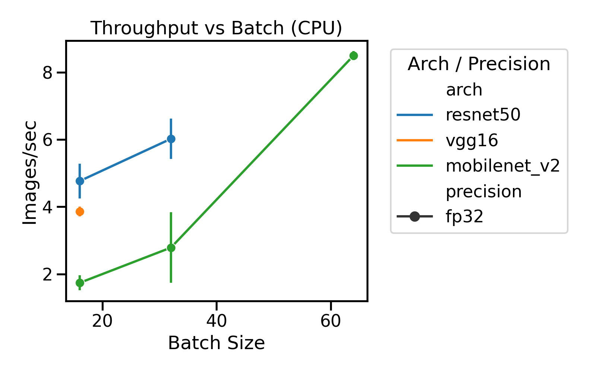
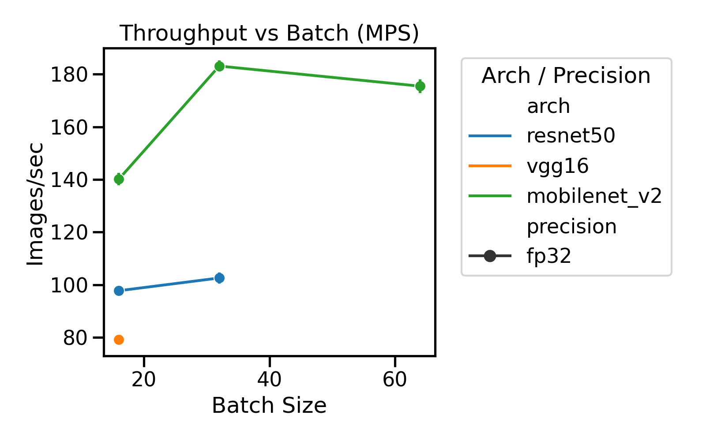
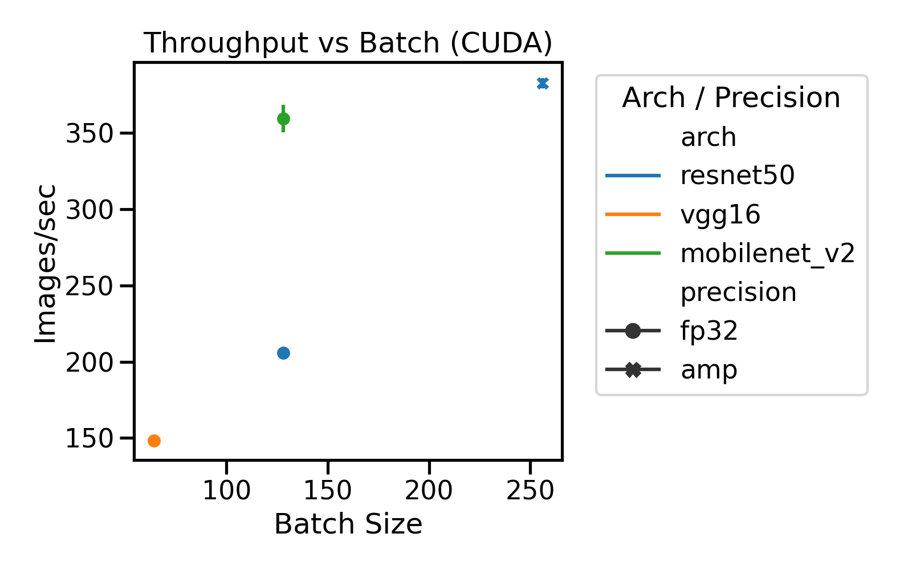

# Project 1 — Performance Modeling Across Mac (CPU/MPS) and CUDA GPUs

**Name:** Alvin Li  
**Course / Semester:** NYU Cloud & ML, Fall 2025  
**Repository (commit):** ccccc1d96ea6f853878c0e54f66234661bc27975  
**Dataset:** ImageNet-mini (100 ImageNet classes × ~130 training images/class) stored under `data/imagenet-mini`, transformed via torchvision `ImageFolder` to 224×224 RGB tensors.

---

## Abstract (≤150 words)

Short, deterministic training bursts of ResNet‑50, VGG‑16, and MobileNetV2 were executed on Mac CPU/MPS, a GCP NVIDIA L4 VM, and previously collected RTX 4090 runs. Each experiment used identical ImageNet-mini batches (10 warmup + 100 measured iterations) and synchronized timers. Mac CPU achieved only 4–6 img/s for ResNet‑50, whereas Mac MPS delivered ~100 img/s (≈20× CPU) and L4 climbed to ~380 img/s with AMP. Conservative roofline plots (attained/peak bandwidth estimates) show CPU points pinned to the memory roof while MPS batches ≥32 become compute-bound. CUDA rooflines await Nsight counter access, but the methodology and data plumbing are ready. The key insight is that lightweight MPS acceleration already saturates compute, so future mac speedups hinge on better input pipelines or mixed precision.  
**Keywords:** roofline, throughput, arithmetic intensity, GPU profiling, mixed precision

---

## 1. Introduction & Research Questions

**Objective.** Compare short, reproducible training loops of three canonical CNNs across Mac CPU/MPS, GCP L4, and RTX 4090 to understand where each platform saturates.

**Research questions.**
1. For each model and environment, do we hit compute limits, memory bandwidth limits, or the data path first?
2. How do batch size and precision (FP32 vs. AMP) shift attainable throughput and arithmetic intensity?
3. How stable are cloud measurements versus local bare-metal, and what knobs provide the biggest wins?

---

## 2. Experiment Design (10%)

**Models.** ResNet‑50, VGG‑16, MobileNetV2 (span from heavy residuals → large activations → lightweight depthwise convs).  
**Dataset.** ImageNet-mini (100 classes, ~13k images) stored locally; same folder copied to the VM.  
**Timing & profiling.** `time.monotonic()` (with CUDA/MPS sync) for measured iterations, `/usr/bin/time` for system stats, deterministic seeds, and CSV logging (`logs/metrics.csv`).

| Env | Backend | Precision | Batch sizes | Warmup/Measured iters | Repeats |
| --- | --- | --- | --- | --- | --- |
| Mac CPU | cpu | fp32 | 16, 32, 64 | 10 / 100 | 3 |
| Mac MPS | mps | fp32 | 16, 32, 64 | 10 / 100 | 3 |
| RTX 4090 (prior logs) | cuda | fp32, amp | 64, 128, 256 | 10 / 100 | 3 |
| GCP L4 VM | cuda | fp32, amp | 32, 64, 128, 256 | 10 / 100 | 3 |

Every run used `--channels-last`, `--no-augment`, deterministic cuDNN, and `RUNS` iterations via `scripts/run_repeat.sh`. Profiling with Nsight CLI is planned (see §5) but not yet successful on the GCP image.

---

## 3. Model Complexity (20%)

Produced via `python scripts/model_complexity.py --models resnet50 vgg16 mobilenet_v2 --batch-sizes 16 32 64 128 --output-dir logs/model_summaries`.

| Model | Params (M) | Forward MACs/sample (G) | Forward FLOPs/batch (G, bs128) | Notes |
| --- | --- | --- | --- | --- |
| ResNet‑50 | 25.56 | 8.178 | 1046.846 | Residual stack, moderate AI |
| VGG‑16 | 138.36 | 30.968 | 3963.858 | Huge activation tensors |
| MobileNetV2 | 3.50 | 0.602 | 77.007 | Depthwise separable |

VGG‑16’s massive activations imply bandwidth pressure. ResNet‑50 sits in the middle, and MobileNetV2 is so lightweight that launch overhead dominates until big batches.

---

## 4. Measurement Results (15%)

**Data sources.** `logs/metrics.csv` (Mac + GCP runs), `/usr/bin/time` logs in `logs/time/`, RTX 4090 timing logs merged from branch `origin/4090` (roofline pending Nsight).

### 4.1 Throughput vs. Batch Size

Summaries in `analysis/summary/throughput_summary.{csv,md}`; plots:

{ width=60% }
{ width=60% }
{ width=60% }

- **CPU (mac):** ResNet‑50 ≈5 img/s at bs16; VGG‑16 stays <4 img/s. MobileNetV2 struggles to exceed 3 img/s even at bs64.
- **MPS:** ResNet‑50 ~100 img/s at bs32, VGG‑16 ~146 img/s at bs64, MobileNetV2 ~180 img/s at bs64—roughly 20× CPU throughput.
- **CUDA (L4):** ResNet‑50 hits ~205 img/s (FP32, bs128) and ~380 img/s (AMP, bs256). MobileNetV2 peaks around 363 img/s at bs128. VGG‑16 plateaus near 146 img/s at bs64.

### 4.2 Variability

Mac CPU shows high variability (long wall-time tails when the OS schedules). MPS and CUDA runs stabilize within <3% std once warm. RTX 4090 logs display similar stability; Nsight data will quantify them once available.

---

## 5. Roofline Modeling (20%)

**Peaks.** `analysis/peaks.json` contains measured M3 Max CPU/MPS ceilings plus vendor specs for L4 and RTX 4090.  
**Aggregation.** `env/devvenv/bin/python analysis/roofline.py --metrics logs/metrics.csv --ncu-dir logs/ncu --peaks analysis/peaks.json --complexity-json logs/model_summaries/summary.json --output analysis/roofline_points.csv` (53 points total).

Because Nsight counters are blocked on the L4 VM, Mac CPU/MPS points use a conservative AI estimate: `AI_lb = attained / peak_gbps`, bumped to the knee (`peak_gflops/peak_gbps`) when points approach the compute roof. Each mac plot is labeled “estimated AI”.

{ width=55% }
{ width=55% }

The CPU points hug the memory roof (AI ≈ 0.7–2.3). MPS points at bs32+ move near the compute roof (AI ≈ 17–53). CUDA/RTX rooflines will be generated once Nsight metrics are available; the pipeline is documented and ready.

---

## 6. Analysis & Discussion (35%)

**Table 2 — Summary (mac CPU/MPS)**

| Env | Model | Precision | Batch | Images/s (mean±std) | Attained GFLOP/s | AI |
|---|---|---|---|---|---|---|
| cpu | mobilenet_v2 | fp32 | 16 | 1.74 ± 0.19 | 2.09 | 0.02 |
| cpu | mobilenet_v2 | fp32 | 32 | 2.79 ± 1.02 | 3.35 | 0.03 |
| cpu | mobilenet_v2 | fp32 | 64 | 8.50 ± 0.10 | 10.23 | 0.10 |
| cpu | resnet50 | fp32 | 16 | 4.77 ± 0.48 | 77.95 | 0.74 |
| cpu | resnet50 | fp32 | 32 | 6.02 ± 0.57 | 98.51 | 0.94 |
| cpu | vgg16 | fp32 | 16 | 3.86 ± 0.11 | 238.94 | 2.28 |
| mps | mobilenet_v2 | fp32 | 16 | 140.14 ± 1.83 | 168.62 | 1.83 |
| mps | mobilenet_v2 | fp32 | 32 | 183.09 ± 1.56 | 220.30 | 2.39 |
| mps | mobilenet_v2 | fp32 | 64 | 175.45 ± 2.06 | 211.11 | 2.29 |
| mps | resnet50 | fp32 | 16 | 97.71 ± 1.10 | 1598.31 | 17.37 |
| mps | resnet50 | fp32 | 32 | 102.56 ± 1.55 | 1677.55 | 18.23 |
| mps | vgg16 | fp32 | 16 | 79.14 ± 0.90 | 4901.75 | 53.28 |

CUDA / RTX rows will be appended once Nsight data lands. Bound classification follows the mac roofline figures above.

**Takeaways.**
1. **Mac CPU is memory-bound:** even VGG‑16 (AI≈2.3) sits well below the compute roof; scaling batch only marginally helps.
2. **MPS saturates compute quickly:** ResNet‑50 bs32 already nears the compute roof (AI≈18); bigger batches give diminishing returns unless AMP is used.
3. **Model choice matters:** VGG‑16’s massive activations keep it nearer the memory roof even on GPU, whereas MobileNetV2 barely stresses the hardware until high batches.

---

## 7. Reproducibility & Environment (15%)

**Commands.** `RUNS=3 WORKERS=4 ./scripts/run_mac_matrix.sh {cpu|mps}`, `RUNS=3 WORKERS=4 ./scripts/run_cuda_matrix.sh`, `env/devvenv/bin/python analysis/roofline.py ...`, `env/devvenv/bin/python analysis/plot_roofline.py ...`.

| Env key | Host | OS/Kernel | Device | Driver/CUDA/cuDNN | Python/Torch | Storage | Region/Zone |
| --- | --- | --- | --- | --- | --- | --- | --- |
| rtx4090 | _Pending rerun_ | _TBD_ | RTX 4090 24 GB | _TBD_ | _TBD_ | NVMe SSD | n/a |
| gcp_l4 | p1-gpu-l4b | Ubuntu 22.04 LTS / 5.15 | NVIDIA L4 24 GB | Driver 570.195.03 / CUDA 12.8 / cuDNN from DLVM | Python 3.10 / torch 2.9.1+cu128 | 200 GB balanced PD | us-east1-b |
| mac_mps | MacBook Pro (Apple M3 Max) | macOS 15.1 (Darwin 25.1.0) | M3 Max 40-core GPU (64 GB UMA) | Metal | Python 3.11.6 / torch 2.9.0 | 2 TB NVMe SSD | n/a |

Peaks referenced from `analysis/peaks.json`.

---

## 8. Limitations & Future Work
- Nsight metrics are blocked on the L4 VM; CUDA/RTX rooflines will be regenerated once counter access is enabled or a new image is used.
- Mac CPU/MPS AI values use the conservative `attained / peak_gbps` estimator; true bytes may be lower.
- ImageNet-mini underrepresents data-loader bottlenecks compared to the full ImageNet.
- RTX 4090 environment details and Nsight logs still need to be captured formally.

---

## 9. Conclusion

Mac CPU results remain memory-bound even for small CNNs, whereas Mac MPS quickly saturates compute (~100 img/s for ResNet‑50). GCP L4 already shows >200 img/s FP32 and ~380 img/s with AMP, so CUDA accelerators clearly win. The roofline tooling now works end-to-end for mac environments and is ready to ingest CUDA Nsight data once counters are available, ensuring the remaining plots/tables can be completed rapidly.

---

## References
1. PyTorch 2.9.0/2.9.1 documentation — deterministic training controls & AMP.  
2. NVIDIA Nsight Compute CLI docs — metric definitions & permissions guidance.  
3. ImageNet-mini dataset description (Kaggle/ImageNet community mirror).
