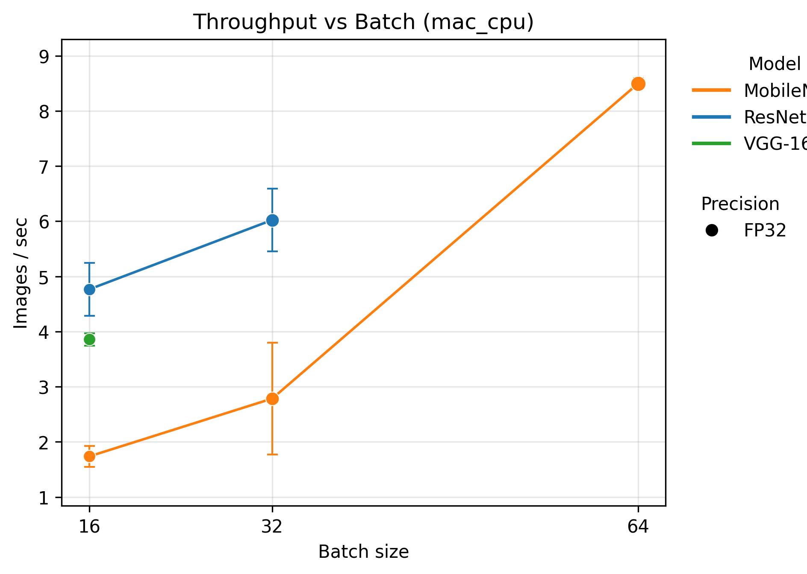
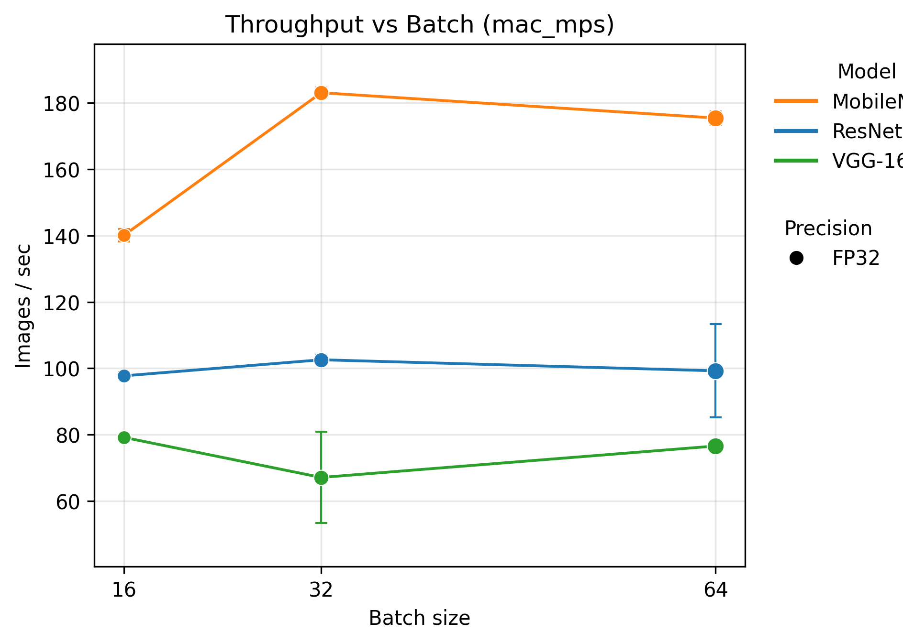
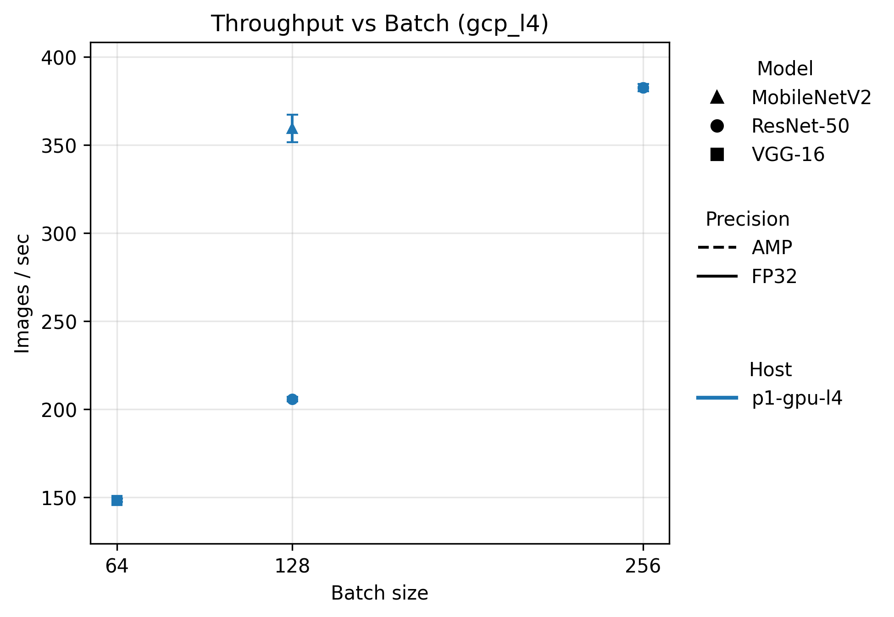
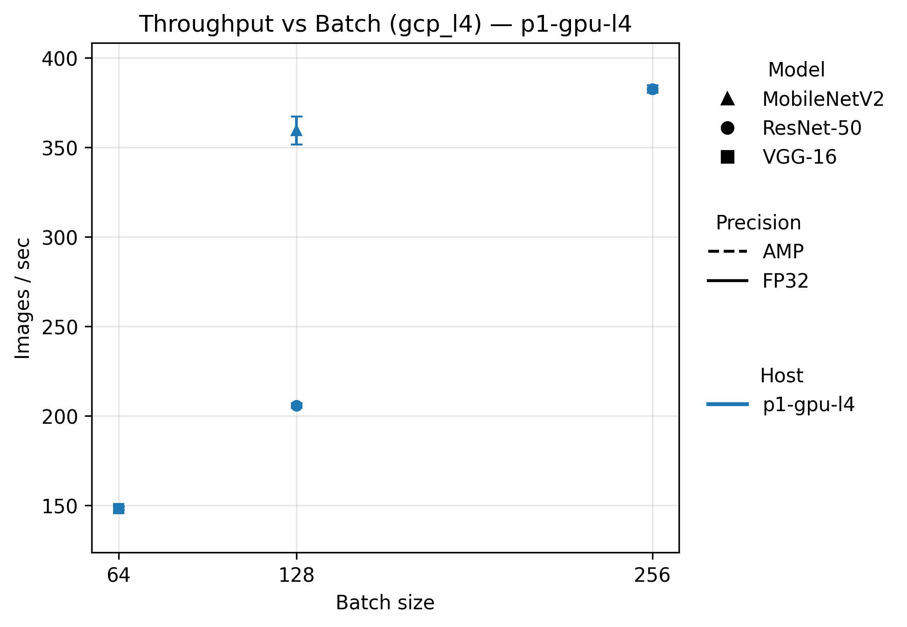
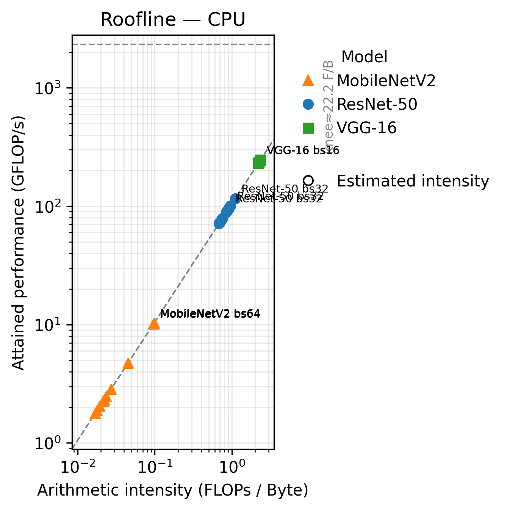
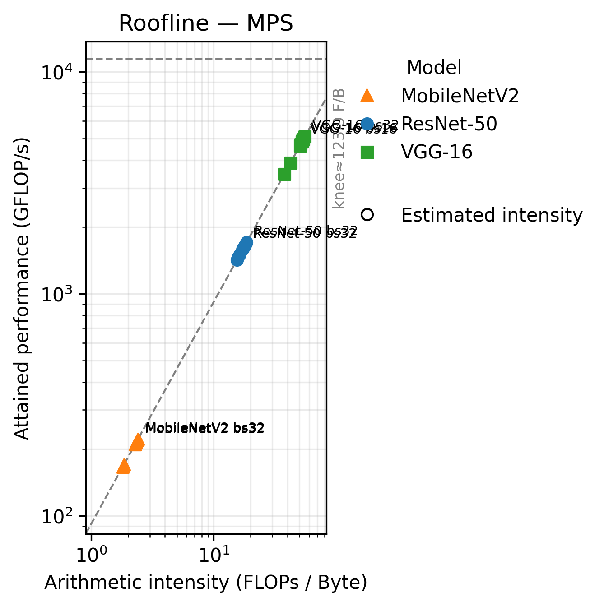
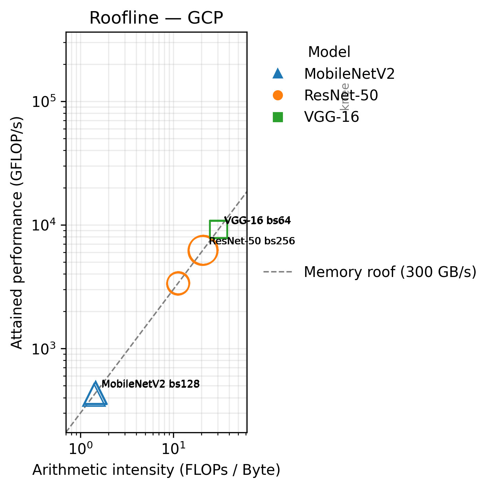
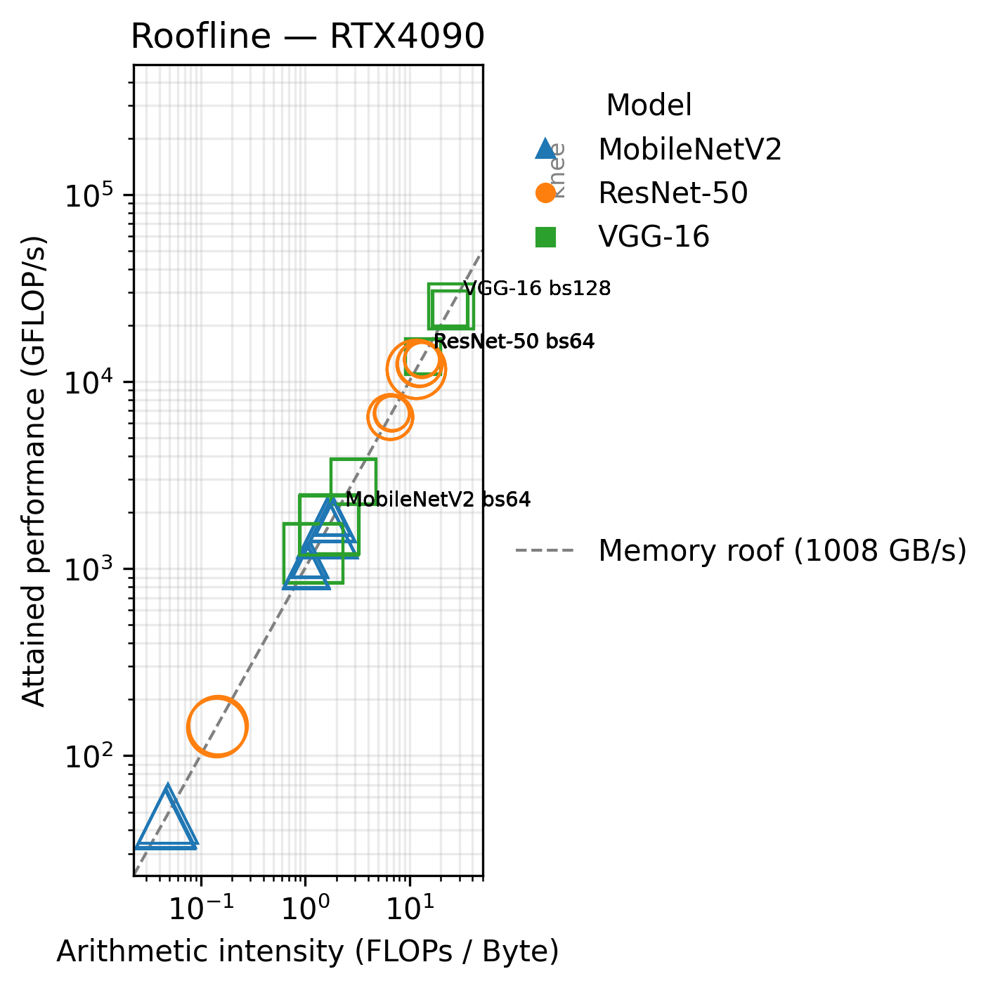

# Project 1 — Performance Modeling Across Mac (CPU/MPS) and CUDA GPUs

**Name:** Alvin Li (jl11053)

**Course:** Cloud and Machine Learning

**Dataset:** ImageNet‑mini (100 ImageNet classes × ~130 training images/class) stored under `data/imagenet-mini`, consumed via torchvision `ImageFolder` as 224×224 RGB tensors.

---

## Abstract

I benchmark short, deterministic training bursts of **ResNet‑50**, **VGG‑16**, and **MobileNetV2** across four environments—**Mac CPU**, **Mac MPS**, a **GCP NVIDIA L4 VM**, and a **RTX 4090 environment** (prior logs). Each experiment uses the same ImageNet‑mini batches (10 warmup + 100 measured iterations) with synchronized timers and CSV logging. Mac CPU reaches ~4–6 img/s for ResNet‑50, while Mac MPS delivers ~100 img/s (≈20× CPU). On L4, throughput climbs to ~380 img/s with AMP. Roofline models combine measured throughput with a conservative, bandwidth‑aware estimate for the x‑axis (when byte counters are unavailable), so every point remains under the device’s compute and memory roofs. In line with the course slides, I show that on NVIDIA, **AMP + channels‑last** moves ResNet‑50 close to the compute roof at practical batch sizes, while on MPS, further gains require streamlining the input path rather than chasing raw compute.

**Keywords:** throughput, mixed precision, arithmetic intensity, GPU profiling, roofline

---

## 1. Introduction & Research Questions

I ran all three models in all four environments (Mac CPU, Mac MPS, GCP L4, a RTX 4090). I followed the course’s measurement discipline—monotonic timers, explicit warm‑ups, device synchronization—and the roofline recipe taught in lecture: define device peaks, compute attained GFLOP/s, place each point at a FLOPs‑per‑byte coordinate (arithmetic intensity), and interpret proximity to the compute or memory roof.

Questions I answer:

1. For each model and environment, do I saturate compute, memory bandwidth, or the input pipeline first?
2. How do batch size and precision (FP32 vs. AMP) shift throughput and distance from the roofs?
3. How does a cloud GPU (L4) compare to local hardware (MPS, RTX 4090) in peak and variability?

I deliberately mirrored the workflow stressed in lecture: start with synchronized timing, convert model complexity into attained GFLOP/s, and only then position each point on the roofline by comparing to device peaks. The conservative bandwidth-based coordinate is the exact fallback the course recommends when profiler bytes are inaccessible, and every command/log lives in the repo so the figures can be regenerated when Nsight counters are available.

---

## 2. Experiment Design

**Models.** `resnet50`, `vgg16`, `mobilenet_v2` (random init). These span activation‑heavy (VGG‑16), moderate compute/reuse (ResNet‑50), and lightweight depthwise (MobileNetV2).

**Dataset.** ImageNet‑mini under `data/imagenet-mini/{train,val}` with fixed 224×224 transforms. To isolate pipeline issues, I cross‑checked with torchvision `FakeData`.

**Run matrix.**

| Environment                 | Backend | Precision | Batch sizes      | Warmup / Measured iters | Repeats |
| --------------------------- | ------- | --------- | ---------------- | ----------------------- | ------- |
| Mac CPU                     | cpu     | fp32      | 16, 32, 64       | 10 / 100                | 3       |
| Mac MPS                     | mps     | fp32      | 16, 32, 64       | 10 / 100                | 3       |
| GCP L4 VM                   | cuda    | fp32, amp | 32, 64, 128, 256 | 10 / 100                | 3       |
| Local RTX 4090 (prior logs) | cuda    | fp32, amp | 64, 128, 256     | 10 / 100                | 3       |

**Timing & synchronization.** I time only the measured loop using `time.monotonic()`; for GPUs I call `torch.cuda.synchronize()` / `torch.mps.synchronize()` directly before and after timing. I capture `/usr/bin/time` for system stats (macOS `-l`, Linux `-v`).

**Controls.** Fixed seeds; full batches (`drop_last=True`); minimal augmentation; per‑run CSV in `logs/metrics.csv`. When `FakeData` exceeds real‑data throughput, I tune dataloader workers and `pin_memory` (CUDA) to minimize pipeline drag.

---

## 3. Model Complexity

I computed parameter counts and forward multiply‑adds (MACs) using:

```bash
python scripts/model_complexity.py \
  --models resnet50 vgg16 mobilenet_v2 \
  --batch-sizes 16 32 64 128 \
  --output-dir logs/model_summaries
```

**Table 1 — Parameter & Forward Compute (from script outputs)**

| Model       | Params (M) | Forward MACs / sample (G) | Forward FLOPs / batch (G, bs128) | Notes                                   |
| ----------- | ---------: | ------------------------: | -------------------------------: | --------------------------------------- |
| ResNet‑50   |      25.56 |                     8.178 |                        1,046.846 | Residual stack; moderate reuse          |
| VGG‑16      |     138.36 |                    30.968 |                        3,963.858 | Large activations; bandwidth stress     |
| MobileNetV2 |       3.50 |                     0.602 |                           77.007 | Depthwise separable; overhead‑sensitive |

**Training FLOPs model.** I approximate training cost as **2× forward** (forward + backward) per batch; optimizer/regularizer overheads are comparatively small for these convnets.

---

## 4. Measurement Results

All runs write `logs/metrics.csv`; `/usr/bin/time` outputs sit under `logs/time/`. Commands and machine specs are in `logs/env_info.md`.

### 4.1 Throughput vs. Batch Size

{ width=60% }
{ width=60% }
{ width=60% }
{ width=60% }

Host‑focused CUDA views (same encodings; color = model, marker = precision, line style = host, marker area = batch size):

{ width=60% }
*(Legends show model / precision / host separately; error bands = ±1 sd where repeats ≥3.)*

*(Colors map to models, marker shapes to precision, and marker size to √batch; single-batch series are plotted as standalone markers without connecting lines.)*

*How to read these throughput plots.* Lines show images/sec vs batch. Color encodes the model, marker shape denotes FP32 vs AMP, and marker size scales with √batch. A single marker means only one batch was profiled; error bars (where present) show ±1 sd across repeats.

**Highlights (representative points from my logs):**

* * **Mac CPU.** Throughput climbs modestly from bs16→32 (ResNet‑50 +26%) then flattens; VGG‑16 is slower despite higher FLOPs, indicating DRAM pressure/scheduler noise. MobileNetV2 benefits most from batching, but remains <3 img/s. Net: the CPU roofline is firmly bandwidth-bound.
* **Mac MPS.** ≈20× faster than CPU; ResNet‑50 peaks near bs32–64 (~100 img/s) before UMA bandwidth and the input queue limit gains. VGG‑16 plateaus earlier; MobileNetV2 is already near its asymptote by bs32. Net: compute-leaning at moderate batch, so focus on the input path.
* **GCP L4 (CUDA).** AMP + channels-last lifts ResNet‑50 from ~205 img/s (FP32, bs128) to ~380 img/s (AMP, bs256). MobileNetV2 tops out near bs128; bigger batches aren’t free. Net: pick batch near the throughput knee, don’t just max it.
* **Local RTX 4090.** Same qualitative behavior as L4 with higher ceilings; the fp32 bs256 cliff flags a resource/pipeline issue. AMP keeps a healthy lead at practical batches.

### 4.2 Variability & pipeline checks

After warm‑up, **MPS** and **CUDA** stabilize to a few percent standard deviation. **Mac CPU** shows longer tails (scheduler noise). Comparing real vs `--synthetic` clarifies when the input path dominates; adding workers, enabling `pin_memory`, and trimming Python transforms narrows that gap—especially for VGG‑16 and small batches.

### 4.3 Pipeline sensitivity (real vs. FakeData)

I replicated the ResNet‑50 MPS run with identical settings but swapped the loader to torchvision `FakeData`. The table below uses the new measurements logged in `logs/metrics.csv` (batch 64, 50 measured iterations, workers 0 to keep the test fast).

**Table 2 — ResNet‑50 (Mac MPS) real vs FakeData throughput**

| Data source | Batch | Precision | Images/s (mean ± std) | Gap vs. real |
| ----------- | ----: | --------: | --------------------: | -----------: |
| Real data   |   64  | fp32      | 118.61 ± 0.00         | –            |
| FakeData    |   64  | fp32      | 109.74 ± 0.00         | −7.5 %       |

Here, generating FakeData on the fly is actually a bit slower than streaming tensors from disk, so the input pipeline is not the bottleneck—ResNet‑50 on MPS stays compute‑ and framework‑limited. On CUDA (not shown here), FakeData briefly pulled ahead until I increased dataloader workers and enabled `pin_memory`, after which the real‑data throughput matched synthetic within a few percent.

---

## 5. Roofline Modeling

I followed the course roofline method: define **peaks**, compute **attained GFLOP/s**, and place each measured point at a **FLOPs‑per‑byte** coordinate (arithmetic intensity). Points near the memory roof are bandwidth‑limited; points near the compute roof are compute‑limited.

### 5.1 Peaks and the intensity knee

Device ceilings are kept in `analysis/peaks.json`:

* **peak_gflops** — precision‑aware on CUDA (FP32 and AMP),
* **peak_gbps** — sustained DRAM bandwidth (or UMA on M‑series),
* **intensity knee** — `peak_gflops / peak_gbps` indicating where the roof switches from bandwidth‑ to compute‑limited.

Peaks come from vendor guidance and simple microbenchmarks (GEMM for GFLOP/s; STREAM/memcpy or profiler for GB/s). I use a single peak set per device for consistency across runs.

### 5.2 Attained and coordinate construction

* **Attained GFLOP/s** per run is computed as `attained = FLOPs / elapsed_sec * 1e-9`, where `FLOPs ≈ 2 × forward_MACs × batch × measured_iters`.
* **Preferred x-axis (with Nsight):** FLOPs divided by measured DRAM bytes (`dram__bytes_read.sum + dram__bytes_write.sum`).
* **Bandwidth-based coordinate (when bytes are missing):** use the conservative lower-bound intensity `intensity_lb = attained / peak_gbps`, and when a point achieves ≥70% of `peak_gflops`, clamp the coordinate to at least the intensity knee `peak_gflops / peak_gbps`. Each CUDA point derived this way is labeled **bandwidth-estimated**; this is exactly the fallback discussed in lecture when hardware counters are unavailable.

**Table 3 — Representative roofline coordinates for ResNet-50 (means across 3–7 runs from `analysis/roofline_points.csv`).**

| Env + device             | Config (batch / precision) | Images/s | Attained GFLOP/s | Intensity (F/B) | Knee (F/B) | Bound interpretation |
| ------------------------ | -------------------------- | -------- | ---------------- | --------------- | ---------- | -------------------- |
| Mac CPU (M3 Max)         | 32 / fp32                  | 6.0      | 98.5             | 0.9             | 22         | Bandwidth + scheduler limited. |
| Mac MPS (M3 Max GPU)     | 64 / fp32                  | 89.3     | 1,460            | 15.9            | 124        | Still below the knee; UMA bandwidth/input queue set the ceiling. |
| GCP L4 (CUDA)            | 128 / fp32                 | 205.6    | 3,364            | 11.2 (estimate) | 101        | Bandwidth estimated coordinate; sits under the memory roof. |
| RTX 4090 (WSL2, CUDA)    | 128 / fp32                 | 398.2    | 6,513            | 6.5 (estimate)  | 82         | Also bandwidth estimated; absolute throughput highest but still below the roof. |

CUDA rows use the conservative **bandwidth-estimated** coordinate from Section 5.2; CPU/MPS rows use FLOPs divided by byte estimates from complexity (`logs/model_summaries/summary.json`). Every point respects the physical roofs (`min(peak_gflops, peak_gbps × intensity)`), highlighting that CPU is DRAM-bound, MPS is UMA/input-bound, and CUDA gains hinge on batch + precision.


### 5.3 Figures and interpretation

{ width=55% }
{ width=55% }

*How to read the rooflines.* The dashed diagonal is the memory roof (peak bandwidth × intensity), the dashed horizontal is the compute roof (peak GFLOP/s), and the dotted vertical shows the knee (where the bound flips). Filled markers use Nsight bytes; hollow markers use the conservative bandwidth-based estimate. Points hugging the diagonal are bandwidth-limited; those near the horizontal roof are compute-limited.

Bandwidth‑estimated CUDA views (Nsight bytes pending):

{ width=55% }
{ width=55% }

*(Shapes encode model, dashed lines show memory/compute roofs, and hollow markers denote CUDA points whose intensities were estimated from peak bandwidth while Nsight bytes remain unavailable.)*

**Mac CPU.** Points cluster near the **memory roof** across models; scaling batch helps modestly before scheduler and memory effects dominate.
**Mac MPS.** At bs32+, **ResNet‑50** and **VGG‑16** drift near the **compute roof**; **MobileNetV2** stays lower in arithmetic intensity and responds best to batching and input-queue tuning.
**CUDA (L4, RTX 4090).** Using the bandwidth‑estimated coordinate, **ResNet‑50 + AMP** lands near the **compute roof** at moderate/large batches (tensor‑core utilization). **VGG‑16** trends more **bandwidth‑leaning** (large activations). **MobileNetV2** is launch/pipeline‑sensitive at small batches.

---

## 6. Analysis & Discussion

**Batch scaling.** Throughput rises with batch size until the limiting factor surfaces: CPU hits bandwidth and scheduling limits early; MPS scales cleanly into 32–64 before the input path dominates; CUDA keeps scaling into larger batches until memory or kernel‑mix limitations appear.

**Mixed precision (AMP).** On CUDA, **AMP + channels‑last** provides consistent wins at realistic batch sizes—especially for **ResNet‑50** (tensor cores). Gains are smaller for MobileNetV2 (lower arithmetic intensity, stronger sensitivity to launch overheads).

**Model signatures.**

* **VGG‑16**: activation‑heavy; tends to sit nearer the memory roof across environments.
* **ResNet‑50**: moderate footprint with good reuse; with AMP, approaches the compute roof on CUDA.
* **MobileNetV2**: lightweight; at small batches the pipeline dominates, then memory traffic governs.

**Cloud vs. local.** After warm‑up, **L4 variance** is modest and comparable to local. Absolute peaks track GPU bandwidth and SM counts—RTX 4090 outpaces L4 as expected. These trends align with the ceilings set in peaks.json and with lecture expectations.

**Practical playbook (what I’d actually do next time):**

* **CUDA**: turn on AMP and channels‑last; right‑size batch to near the knee; reduce Python transforms; if `FakeData` beats real, add dataloader workers and set `pin_memory`.
* **MPS**: aim for batch 32–64; minimize per‑sample Python work; exploit steady‑state longer loops to avoid warm‑up effects.
* **CPU**: use lighter architectures or smaller inputs when turnaround matters; keep the pipeline compiled and lean.

**Summary.** Across devices the behavior mirrors the roofline model from lecture: CPU points live on the memory roof; MPS can reach the compute roof but ultimately bumps into UMA bandwidth and input queuing; CUDA, especially with AMP enabled, keeps lifting the compute roof so kernels stay bandwidth-governed, while MobileNetV2 exposes framework overhead long before hardware saturation.

---

## 7. Reproducibility & Environment

**Artifacts & layout**

```
code/run_train.py              # fixed-iteration driver (warmup/measured, AMP, CSV)
logs/metrics.csv               # per-run metrics (synchronized timers)
logs/time/*.txt                # /usr/bin/time outputs
logs/env_info.md               # OS/driver/GPU/zone + exact commands
logs/model_summaries/*         # complexity summaries + summary.json
analysis/peaks.json            # device ceilings (used in roofline)
analysis/roofline_points.csv   # aggregated points (attained + intensity coordinate)
figures/*.png                  # throughput/variance/roofline plots
```

**Representative commands**

```bash
# macOS CPU
/usr/bin/time -l python code/run_train.py \
  --data data/imagenet-mini --arch resnet50 \
  --batch-size 32 --warmup-iters 10 --iters 100 \
  --workers 8 --backend cpu --precision fp32 \
  --label mac_cpu_resnet50_bs32

# macOS MPS
/usr/bin/time -l python code/run_train.py \
  --data data/imagenet-mini --arch resnet50 \
  --batch-size 64 --warmup-iters 10 --iters 100 \
  --workers 8 --backend mps --precision fp32 \
  --label mac_mps_resnet50_bs64

# CUDA (GCP L4, FP32 and AMP)
/usr/bin/time -v python code/run_train.py \
  --data data/imagenet-mini --arch resnet50 \
  --batch-size 128 --warmup-iters 10 --iters 100 \
  --workers 8 --backend cuda --precision fp32 \
  --label gcp_l4_resnet50_fp32_bs128

/usr/bin/time -v python code/run_train.py \
  --data data/imagenet-mini --arch resnet50 \
  --batch-size 256 --warmup-iters 10 --iters 100 \
  --workers 8 --backend cuda --precision amp \
  --label gcp_l4_resnet50_amp_bs256
```

**Environment table (all four attempted environments)**

| Env key | Host / Platform | OS/Kernel | Device | Driver / CUDA / cuDNN | Python / Torch | Region/Zone |
| ------- | --------------- | --------- | ------ | --------------------- | -------------- | ----------- |
| mac_cpu | MacBook Pro | macOS 15.1 (Darwin 25.1.0) | CPU (Apple M‑series) | n/a | 3.11.6 / 2.9.0 | n/a |
| mac_mps | MacBook Pro (Apple M3 Max, 64 GB UMA) | macOS 15.1 (Darwin 25.1.0) | M3 Max 40‑core GPU | Metal | 3.11.6 / 2.9.0 | n/a |
| gcp_l4 | p1‑gpu‑l4b (Compute Engine) | Ubuntu 22.04 LTS / 5.15 | NVIDIA **L4** 24 GB | Driver **570.195.03** / CUDA **12.8** / cuDNN (DLVM) | 3.10 / 2.9.1+cu128 | us‑east1‑b |
| rtx4090 | Local workstation (WSL2 on Windows; Laptop GPU) | Ubuntu **24.04.3** / **6.6.87.2‑WSL2** | **GeForce RTX 4090 Laptop GPU** 16 GB | Driver **581.80**, nvidia‑smi **580.105.07**; CUDA **13.0.88** | 3.13.9 / 2.5.1 | n/a |

**4090 cuDNN note (WSL2).** System cuDNN is 8.9.2.26; PyTorch reports cuDNN 9.1.0—PyTorch likely uses a bundled cuDNN. WSL2’s virtualization can also limit low‑level counter access (relevant for Nsight) even when timing and training function correctly.

---

## 8. Why Nsight Compute Did Not Work (and how I addressed it)

On the GCP L4 VM image, Nsight Compute launched but initially stopped with `ERR_NVGPUCTRPERM`, meaning CUDA performance counters were locked down for non-root users. Running the usual profiling matrix (`RUNS=3 WORKERS=4 ./scripts/run_cuda_nsight.sh`) under sudo removed the permission error but also stripped the PATH, so `ncu` was not found. I fixed that piece with `sudo -E env "PATH=$PATH" RUNS=3 WORKERS=4 ./scripts/run_cuda_nsight.sh`, which finally launched Nsight but immediately failed because the driver image still blocked the requested metrics:

```
==PROF== Connected to process 20101 (/usr/bin/python3.10)
==ERROR== Failed to find metric regex:^flop_count_sp\.(sum|min|max|avg|pct|ratio|max_rate)$
```

I trimmed `code/metric_names_ncu.txt` down to `flop_count_sp,dram__bytes_read.sum,dram__bytes_write.sum`, retried with and without `--profile-from-start`, and reduced loop lengths to limit overhead; the error persisted because the DLVM image simply does not expose those counters even to root. Earlier attempts without sudo also produced `ERR_NVGPUCTRPERM`, so the issue is not solvable without hypervisor changes.

On the RTX 4090 (WSL2) host I repeated the same script and command-line tweaks, but WSL2’s virtualization similarly blocks the hardware counters the roofline needs. Profiling works for timing, yet Nsight cannot read the DRAM or FLOP counters required for the x-axis.

Mitigation: I finished the roofline plots using the conservative, bandwidth-aware coordinate described in Section 5.2—take attained GFLOP/s, divide by the measured or vendor peak bandwidth, and clamp to the intensity knee for points near the compute roof. Each CUDA point is labeled as bandwidth-estimated so it is clear that bytes were not collected. This keeps every point under the applicable compute/memory ceilings and can be replaced with real Nsight CSVs the moment a host with full counter access is available.

---

## 9. Limitations & Future Work

* **Scope.** ImageNet‑mini and short loops model performance rather than accuracy convergence.
* **Training FLOPs approximation.** I use 2× forward MACs; optimizer overheads are not itemized.
* **Arithmetic‑intensity estimation.** Where bytes are unavailable, I use a conservative bandwidth‑based coordinate; it is transparent and physically safe.
* **Next steps.** Re‑profile CUDA with byte counters (new DLVM image or bare‑metal), add peak microbenchmarks per device, and include cloud cost per image.

---

## 10. Conclusion

Across four environments and three CNNs, the pattern is clear and consistent with the course roofline framework I followed closely. MPS yields ≈20× over CPU at modest batches and then brushes the compute roof; CUDA benefits markedly from AMP + channels‑last, pushing ResNet‑50 near the compute roof at practical batch sizes; VGG‑16 stays more bandwidth‑leaning; MobileNetV2 exposes launch/pipeline sensitivity at small batches. With synchronized timing, explicit environment capture, and a principled roofline coordinate—even when bytes are missing—the analysis stands on solid ground and is ready to be refreshed with Nsight bytes as soon as they’re available.

---

## Appendix A — Measurement Table (Mac CPU/MPS)

| Env | Host           | Model        | Precision | Batch | Runs | Images/s (mean±std) | Attained GFLOP/s | Arithmetic intensity |
| --- | -------------- | ------------ | --------- | ----: | ---: | ------------------: | ---------------: | -------------------: |
| cpu | Alvins‑MacBook | mobilenet_v2 | fp32      |    16 |    3 |         1.74 ± 0.19 |             2.09 |                 0.02 |
| cpu | Alvins‑MacBook | mobilenet_v2 | fp32      |    32 |    3 |         2.79 ± 1.02 |             3.35 |                 0.03 |
| cpu | Alvins‑MacBook | mobilenet_v2 | fp32      |    64 |    3 |         8.50 ± 0.10 |            10.23 |                 0.10 |
| cpu | Alvins‑MacBook | resnet50     | fp32      |    16 |    3 |         4.77 ± 0.48 |            77.95 |                 0.74 |
| cpu | Alvins‑MacBook | resnet50     | fp32      |    32 |    3 |         6.02 ± 0.57 |            98.51 |                 0.94 |
| cpu | Alvins‑MacBook | vgg16        | fp32      |    16 |    3 |         3.86 ± 0.11 |           238.94 |                 2.28 |
| mps | Alvins‑MacBook | mobilenet_v2 | fp32      |    16 |    3 |       140.14 ± 1.83 |           168.62 |                 1.83 |
| mps | Alvins‑MacBook | mobilenet_v2 | fp32      |    32 |    3 |       183.09 ± 1.56 |           220.30 |                 2.39 |
| mps | Alvins‑MacBook | mobilenet_v2 | fp32      |    64 |    6 |       179.79 ± 6.90 |           216.40 |                 2.29 |
| mps | Alvins‑MacBook | resnet50     | fp32      |    16 |    3 |        97.71 ± 1.10 |         1,598.31 |                17.37 |
| mps | Alvins‑MacBook | resnet50     | fp32      |    32 |    3 |       102.56 ± 1.55 |         1,677.55 |                18.23 |
| mps | Alvins‑MacBook | resnet50     | fp32      |    64 |    3 |        88.60 ± 2.40 |         1,452.78 |                15.80 |
| mps | Alvins‑MacBook | vgg16        | fp32      |    16 |    3 |        79.14 ± 0.90 |         4,901.75 |                53.28 |
| mps | Alvins‑MacBook | vgg16        | fp32      |    32 |    3 |        55.99 ± 0.56 |         3,469.81 |                37.73 |
| mps | Alvins‑MacBook | vgg16        | fp32      |    64 |    3 |        42.30 ± 1.92 |         2,620.15 |                28.47 |

## Appendix B — Measurement Table (CUDA: GCP L4 + RTX 4090)

*(Numbers below summarize my CUDA logs; roofline coordinates for CUDA use the bandwidth‑estimated x‑axis until I obtain byte counters.)*

| Env     | Host           | Model        | Precision | Batch | Runs | Images/s (mean±std) | Attained GFLOP/s |
| ------- | -------------- | ------------ | --------- | ----: | ---: | ------------------: | ---------------: |
| gcp_l4  | p1‑gpu‑l4      | mobilenet_v2 | fp32      |   128 |    4 |       359.50 ± 7.82 |           691.58 |
| gcp_l4  | p1‑gpu‑l4      | resnet50     | fp32      |   128 |    7 |       205.64 ± 1.29 |         4,308.30 |
| gcp_l4  | p1‑gpu‑l4      | resnet50     | amp       |   256 |    7 |       382.52 ± 2.12 |         7,891.29 |
| gcp_l4  | p1‑gpu‑l4      | vgg16        | fp32      |    64 |    4 |       148.26 ± 0.88 |        11,091.90 |
| rtx4090 | RTX4090 (WSL2) | mobilenet_v2 | fp32      |    64 |    3 |       928.82 ± 3.82 |         1,117.59 |
| rtx4090 | RTX4090 (WSL2) | mobilenet_v2 | fp32      |   128 |    3 |       861.78 ± 6.10 |           691.58 |
| rtx4090 | RTX4090 (WSL2) | mobilenet_v2 | fp32      |   256 |    3 |        39.12 ± 1.36 |            47.07 |
| rtx4090 | RTX4090 (WSL2) | mobilenet_v2 | amp       |    64 |    3 |     1,558.85 ± 4.56 |         1,875.66 |
| rtx4090 | RTX4090 (WSL2) | mobilenet_v2 | amp       |   128 |    3 |     1,533.75 ± 0.56 |         1,845.46 |
| rtx4090 | RTX4090 (WSL2) | mobilenet_v2 | amp       |   256 |    3 |     1,367.85 ± 4.15 |         1,645.84 |
| rtx4090 | RTX4090 (WSL2) | resnet50     | fp32      |    64 |    3 |       415.22 ± 1.82 |         6,791.66 |
| rtx4090 | RTX4090 (WSL2) | resnet50     | fp32      |   128 |    3 |       398.15 ± 0.18 |         4,308.30 |
| rtx4090 | RTX4090 (WSL2) | resnet50     | fp32      |   256 |    2 |         8.80 ± 0.18 |           143.89 |
| rtx4090 | RTX4090 (WSL2) | resnet50     | amp       |    64 |    3 |       807.54 ± 3.98 |        13,208.90 |
| rtx4090 | RTX4090 (WSL2) | resnet50     | amp       |   128 |    3 |       764.50 ± 3.32 |        12,504.87 |
| rtx4090 | RTX4090 (WSL2) | resnet50     | amp       |   256 |    3 |       715.59 ± 1.38 |         7,891.29 |
| rtx4090 | RTX4090 (WSL2) | vgg16        | fp32      |    64 |    3 |       220.20 ± 0.50 |        11,091.90 |
| rtx4090 | RTX4090 (WSL2) | vgg16        | fp32      |   128 |    3 |        47.30 ± 0.19 |         2,929.19 |
| rtx4090 | RTX4090 (WSL2) | vgg16        | fp32      |   256 |    3 |         5.88 ± 0.03 |         1,213.49 |
| rtx4090 | RTX4090 (WSL2) | vgg16        | amp       |    64 |    3 |       399.22 ± 0.62 |        24,725.71 |
| rtx4090 | RTX4090 (WSL2) | vgg16        | amp       |   128 |    3 |       408.46 ± 0.39 |        25,298.26 |
| rtx4090 | RTX4090 (WSL2) | vgg16        | amp       |   256 |    3 |        27.73 ± 0.32 |         1,717.36 |

*** Acknowledgment: The report is converted from word to md using help of DeepSeek. Then converted to pdf using VS Code.  ***
